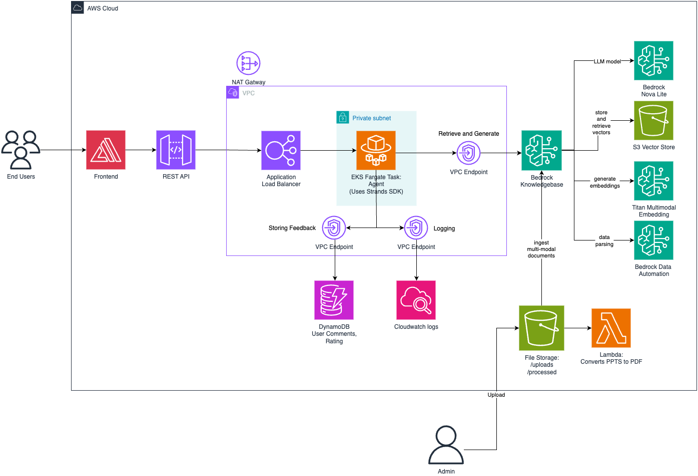

# iECHO RAG Chatbot

An intelligent multi-domain chatbot built with AWS Bedrock, Strands framework, and deployed on EKS Fargate. The system provides specialized expertise in TB, Agriculture, and General health/education through natural language routing to domain-specific agents with knowledge base integration.


| Index                                               | Description                                             |
| :-------------------------------------------------- | :------------------------------------------------------ |
| [High Level Architecture](#high-level-architecture) | High level overview illustrating component interactions |
| [Deployment](#deployment-guide)                     | How to deploy the project                               |
| [User Guide](#user-guide)                           | The working solution                                    |
| [Directories](#directories)                         | General project directory structure                     |
| [API Documentation](#api-documentation)             | Documentation on the API the project uses               |
| [Evaluation](#evaluation)                           | Model evaluation and testing framework                  |
| [Troubleshooting](#troubleshooting)                 | Common issues and solutions                             |
| [Credits](#credits)                                 | Meet the team behind the solution                       |
| [License](#license)                                 | License details                                         |

## High-Level Architecture

The following architecture diagram illustrates the various AWS components utilized to deliver the solution. For an in-depth explanation of the backend, please look at the [Architecture Guide](docs/architectureDeepDive.md).



## Deployment Guide

To deploy this solution, please follow the steps laid out in the [Deployment Guide](./docs/deploymentGuide.md)

## User Guide

Please refer to the [Web App User Guide](./docs/userGuide.md) for instructions on using the web app.

## Directories

```
├── backend/
│   ├── bin/
│   ├── lib/
│   ├── lambda/
│   ├── docker/
│   │   └── app/
│   ├── .env.example
│   └── deploy.sh

├── docs/
│   ├── architectureDeepDive.md
│   ├── deploymentGuide.md
│   ├── userGuide.md
│   └── media/

├── frontend/
│   ├── public/
│   ├── pages/
│   ├── app/
│   ├── components/
│   ├── hooks/
│   ├── lib/
│   └── .env.example

├── buildspec.yml
├── buildspec-frontend.yml
├── deploy.sh
├── cleanup.sh
├── LICENSE
└── README.md
```

1. **`backend/`**: AWS CDK app and backend code
   - `bin/`: CDK app entry point (stack instantiation)
   - `lib/`: CDK stacks and constructs (infrastructure as code)
   - `lambda/office-to-pdf/`: Lambda function for document conversion (DOCX/XLSX/PPTX to PDF)
   - `docker/app/`: Python FastAPI application with multi-agent orchestration
   - `.env.example`: Template for backend environment variables
2. **`docs/`**: Architecture, deployment, and user guides with media assets
3. **`frontend/`**: Next.js web application with Amplify deployment
   - `pages/echo-knowledge-base.tsx`: Main chat interface component
   - `app/`: Next.js App Router configuration
   - `components/`: Reusable UI components
   - `hooks/`: Custom React hooks (use-chat, use-feedback)
   - `lib/`: Utility functions and configuration
   - `.env.example`: Template for frontend environment variables
4. **Root**: Deployment scripts and build configurations
   - `deploy.sh`: Main deployment script (backend + frontend)
   - `cleanup.sh`: Complete resource cleanup script
   - `buildspec.yml`: Backend deployment buildspec
   - `buildspec-frontend.yml`: Frontend deployment buildspec

## API Documentation

Here you can learn about the API the project uses: [API Documentation](./docs/APIdoc.md).

## Evaluation

Model evaluation and testing framework can be found in the [Evaluation Guide](./docs/evaluationGuide.md).

## Troubleshooting

Common issues and solutions can be found in the [Troubleshooting Guide](./docs/troubleshooting.md).

## Credits

This application was architected and developed by:

- **Sahajpreet Singh Khasria** - Backend Developer (<a href="https://www.linkedin.com/in/sahajpreet" target="_blank">LinkedIn</a>)
- **Apoorv Singh** - Frontend Developer (<a href="https://www.linkedin.com/in/apoorv16/" target="_blank">LinkedIn</a>)
- **Jenny Nguyen** - UI/UX Designer (<a href="https://www.linkedin.com/in/jennnyen/" target="_blank">LinkedIn</a>)

Thanks to the development team for their guidance and support in building this intelligent multi-domain RAG chatbot solution.

## License

This project is distributed under the [MIT License](LICENSE).