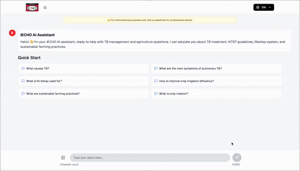
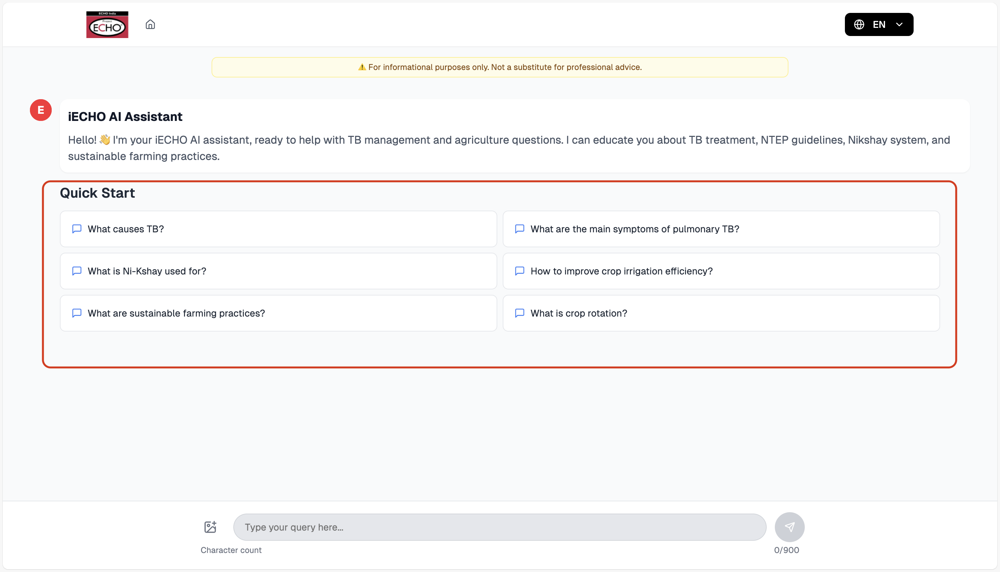
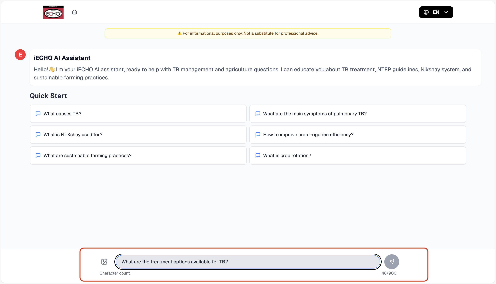
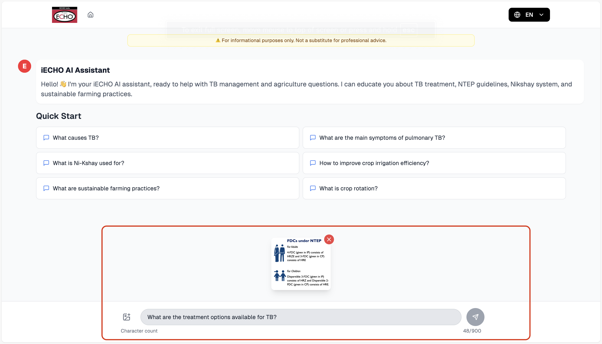
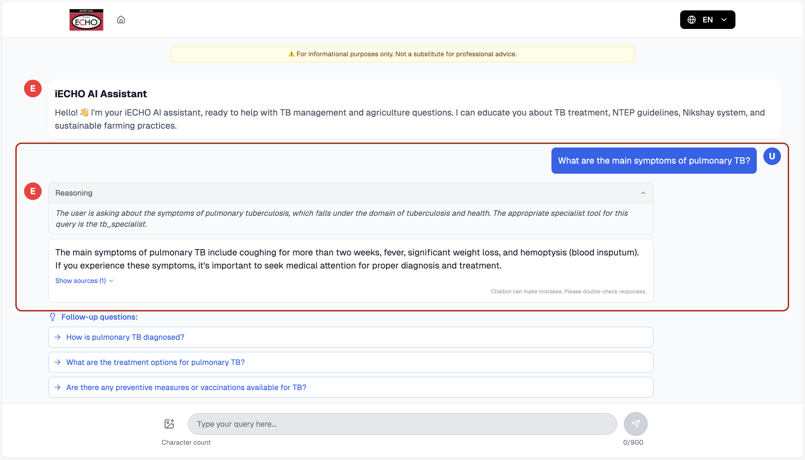
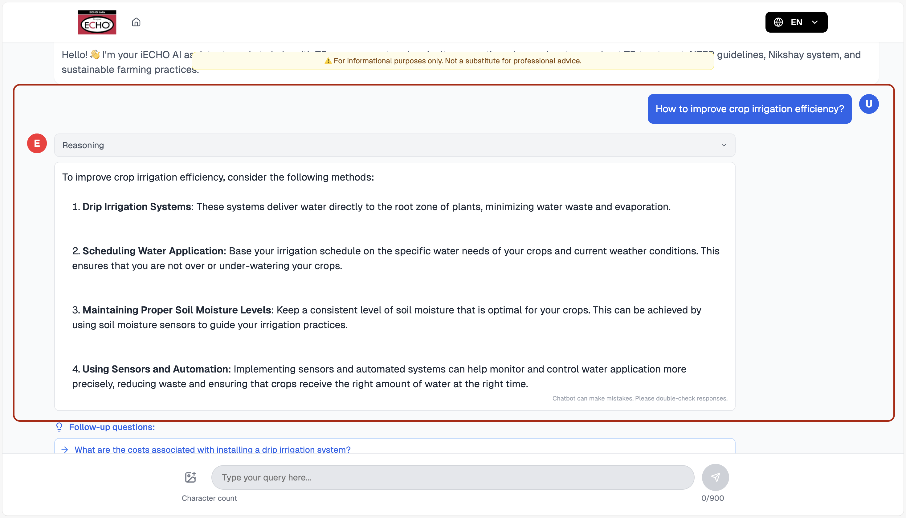
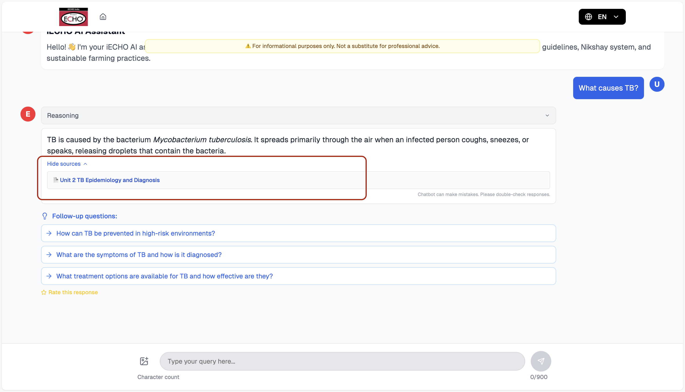
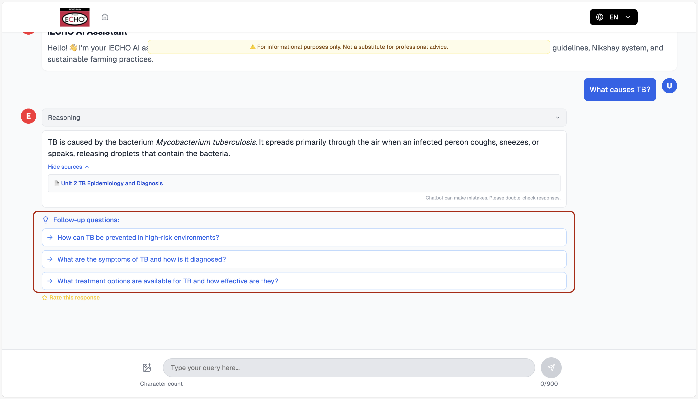
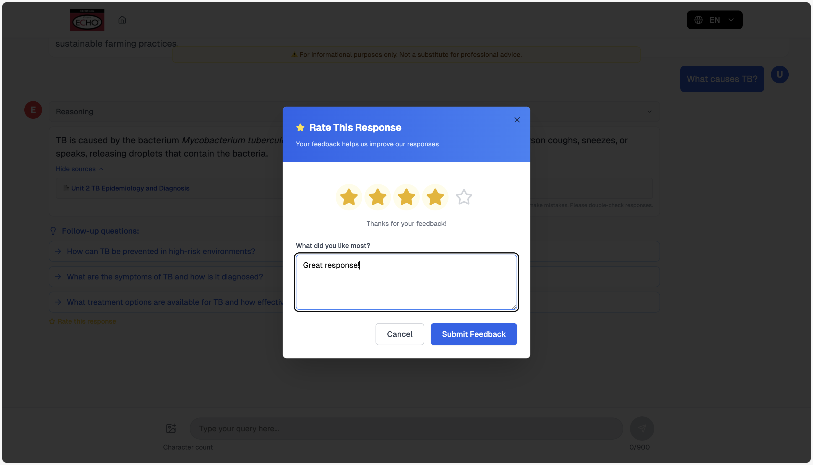

# User Guide

**Please ensure the application is deployed using the instructions in the deployment guide:**
- [Deployment Guide](./deploymentGuide.md)

Once you have deployed the solution, this user guide will help you navigate the available functions and features.

## Overview

The iECHO RAG Chatbot provides intelligent multi-domain conversational AI assistance for:
- **Tuberculosis (TB)**: Medical information, symptoms, treatment, and prevention
- **Agriculture**: Farming practices, crop management, irrigation, and food safety  

The system uses specialized AI agents that automatically route your queries to the most appropriate expert, providing accurate responses with citations from a comprehensive knowledge base.

**Important Disclaimer**: This is an educational tool and should not be used for medical diagnosis or treatment decisions. Always consult healthcare professionals for medical advice.

## Getting Started

### Accessing the Application

After deployment, you'll receive:
1. **Frontend URL**: The Amplify-hosted web application
2. **API Gateway URL**: Backend API endpoint (for developers)

Navigate to the Frontend URL to start using the chatbot.

### Main Interface

The main interface consists of:
- **Chat Area**: Displays conversation with agent responses
- **Input Box**: Type your questions or upload images
- **Quick Start**: Suggested questions to get you started
- **Citations**: Source documents for each response

## Features

### 1. Multi-Domain Query Routing

The system automatically determines which specialist agent should handle your query:

**TB Specialist Agent**:
- Tuberculosis symptoms and diagnosis
- Treatment options and medications
- Prevention and transmission

**Agriculture Specialist Agent**:
- Crop management and farming techniques
- Irrigation and water management
- Soil health and fertilization
- Pest and disease control

### 2. Quick Start Questions

When you first visit the application, you'll see suggested questions:

**TB Questions**:
- "What causes TB?"
- "What are the main symptoms of pulmonary TB?"
- "What is Ni-Kshay used for?"
- "How is TB transmitted?"

**Agriculture Questions**:
- "How to improve crop irrigation efficiency?"
- "What are sustainable farming practices?"
- "What is crop rotation?"
- "How to prevent crop diseases?"

Click any question to get started immediately.

### 3. Text and Image Input

**Text Input**:
- Type your question in the input box
- Press Enter or click Send to submit
- Support for complex, multi-part questions

**Image Input**:
- Click the camera icon (📷) to upload images
- Supported formats: JPG, PNG, GIF
- Maximum file size: 10MB
- Use for plant disease identification, medical images, or visual questions

**Image Upload Process**:
1. Click the camera icon
2. Select image from your device
3. Preview appears in the input area
4. Add text description if needed
5. Send to get AI analysis

### 4. Intelligent Responses

**TB Specialist Responses Include**:
- Detailed medical information
- Symptom descriptions and explanations
- Treatment guidelines and options
- Prevention strategies
- Citations from medical literature

**Agriculture Specialist Responses Include**:
- Farming best practices
- Crop-specific advice
- Irrigation and water management
- Soil health recommendations
- Citations from agricultural resources

### 5. Citations and Sources

Every response includes:
- **Source Documents**: Original documents used for the response
- **Document Links**: Click to access full source documents

### 6. Follow-up Questions

After each response, the system suggests relevant follow-up questions:
- Related topics to explore further
- Deeper dive into specific aspects

Click any follow-up question to continue the conversation.

### 7. Rating and Feedback

Help improve the system by providing feedback:
- **Star Rating**: Rate responses from 1-5 stars
- **Text Feedback**: Provide specific comments

**To Rate a Response**:
1. Click the star icon on any response
2. Select star rating (1-5 stars)
3. Add text feedback
4. Submit to help improve the system

## Usage Tips

### Getting Better Responses

**Be Specific**:
- ❌ "Tell me about farming"
- ✅ "How can I improve soil fertility?"

**Include Context**:
- ❌ "What causes it?"
- ✅ "What causes TB?"

**Use Images When Helpful**:
- Upload photos for better enhanced context

### Understanding Agent Responses

**Agent Indicators**:
- **🩺 TB Specialist**: Medical and health-related queries
- **🌾 Agriculture Specialist**: Farming and agricultural topics

**Response Elements**:
- **Main Answer**: Comprehensive response to your query
- **Citations**: Source documents and references
- **Follow-ups**: Suggested next questions

### Session Management

**Conversation History**:
- Each session maintains conversation context
- Previous questions and answers are remembered
- Context helps provide more relevant responses
- Sessions automatically expire after 1 hour of inactivity

**Starting Fresh**:
- Click the home icon to start fresh
- Resets to quick start questions
- Useful for switching topics
